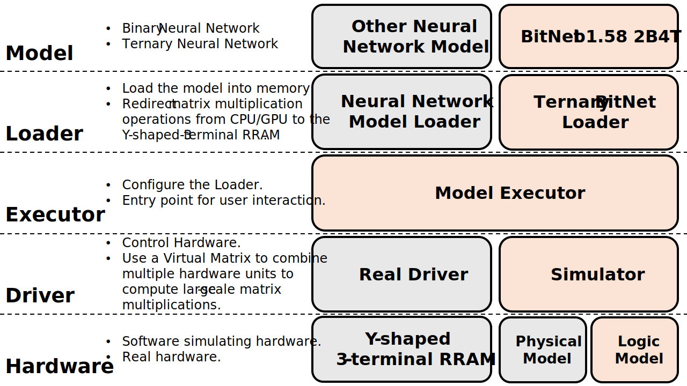

# 競爭型RRAM - 無ADC的算存一體元件 (Filament Competitive RRAM - A CIM device without ADC)

> **Competition:** [美光半導體創新應用競賽 (Micron Mimory Awards)](https://www.micron-mimoryawards.org.tw/)
> 
> **Category:** Device Design and Development Category (元件/裝置設計開發組)
> 
> **Team ID:** 2526_C_0039 

## Introduction

本專案為參與 **[美光半導體創新應用競賽](https://www.micron-mimoryawards.org.tw/)** 之「裝置設計與開發組 (Device Design and Development Category)」的正式參賽作品。

本專案旨在解決目前大型語言模型（LLMs）在邊緣運算上所面臨的「記憶體之牆」與「功耗之牆」瓶頸。我們提出了一種新穎的無 ADC (Analog-to-Digital Converter) 算存一體 (Compute-in-Memory, CIM) 架構。

我們聚焦於最新的微軟 BitNet b1.58 技術，並設計出專為三元權重 {-1, 0, 1} 量身打造的「Y型三端子 RRAM (Y-Shape 3-Terminal RRAM)」。透過引入位元序列 (Bit-Serial) 讀取架構與超低功耗的偏移補償感測放大器 (OCSA)，本系統成功移除了佔據極大面積與功耗的高精度 ADC。此架構在保持複雜 AI 運算能力的同時，將能效推向邊緣設備的極致。

[觀看我們的 YouTube 介紹影片](https://youtu.be/rJdns5PzIjU?si=fm3VBMsV4NXAxrrs)

---

## Software Simulation

為了驗證此架構的可行性，我們開發了一套由下而上的跨層次軟體模擬框架。此框架能真實模擬底層硬體資源分配，並統計運算效能以進行能耗估算。

### Architecture

<p align="center">
  
</p>

系統的軟體架構被設計為高度解耦的四個主要抽象層：

* **Loader (`model_loading`)：** 作為模型與硬體間的橋樑。以 `TernaryBitNetLoader` 為例，它負責載入 PyTorch 模型、進行 Tokenization，並將 `BitLinear` 層的權重量化後派發至底層硬體驅動器。

* **Executor (`model_executor.py`)：** 系統的控制中樞。負責管理 Driver 與 Loader 的生命週期、執行推論任務（包含非同步串流生成），並自動將每回合的硬體動態操作數據與日誌匯出至本地端。

* **Driver (`RRAM_Driver`)：** 扮演硬體模擬器的角色 (`RRAM_Simulator`)。由於單一物理 RRAM 陣列的尺寸限制（本專案設定為 $256\times256$），Driver 內建了 `VirtualMatrix` 機制，能夠自動將大型邏輯矩陣進行切割 (Auto-Tiling) 並映射到多個物理硬體 Tile 上，完美模擬大型模型在多陣列晶片上的資料流。

* **Hardware (`RRAM_Hardware`)：** 定義了嚴格的硬體抽象層 API (HAL)。這確保了現在的軟體模擬器與未來的真實物理硬體 (如 FPGA 或 ASIC) 可以無縫切換與對接。


### Installation

1.  **環境需求：** 請使用 **Python 3.10** 版本。
2.  **安裝依賴：** 請透過專案提供的 `requirements.txt` 進行環境建置。在終端機中執行以下指令：
    ```bash
    pip install -r requirements.txt
    ```

### Download Model

1.  **環境變數設定：** 本專案在初始化 Tokenizer 或與模型庫互動時，需要使用 Hugging Face 的存取權杖。請在專案的根目錄下建立一個名為 `.env` 的檔案，並填入您的 Token：
    ```env
    HP_TOKEN=your_huggingface_token_here
    ```

2.  **準備模型權重：** 本專案預設使用 BitNet b1.58 2B-4T 作為主要測試模型。您可以直接執行專案內的模型註冊腳本來處理權重：
    ```bash
    python register_model.py
    ```
    * 該腳本在主程式中會呼叫 `ModelImportHandler.import_all_model()`。
    * 它會嘗試尋找並載入預設的 `BitNet_2B4T.safetensors` 權重檔案，將其初始化為 `NLP_BitNet_2B4T_TNN` 模型。如果沒有預訓練權重檔案，請至 [Hugging Face](https://huggingface.co/microsoft/bitnet-b1.58-2B-4T-bf16) 下載微軟開源的模型權重。
    * 處理完成後，`ModelImportHandler` 會自動將模型轉換並儲存至專案預設的目錄下（即 `data/model/NLP_BitNet_2B4T_TNN.pickle`）。


### Execution

若要快速啟動並進行文字生成推論測試，可以直接執行專案內的實驗腳本：

```bash
python TernaryBitNet_experiment.py
```

* **配置確認：** 在執行前，請開啟 `TernaryBitNet_experiment.py`，確認 `MODEL_PATH` 變數正確指向您的模型權重檔案路徑。
* **輸出結果：** 程式將會啟動兩回合的推論對話測試，並即時串流輸出生成的文字。
* **效能統計：** 每次執行完畢後，Executor 會自動在 `data/logs/` 目錄下產生帶有時間戳記的資料夾，內部包含詳細的 `log.json`（記錄了程式寫入次數、硬體 Tile 使用量、運算次數等統計數據）以及輸入輸出的 Pickle 備份資料。


### For Future

本專案的軟體架構具備極高的擴充彈性：

* **擴充自定義模型：** 本專案支援您輕鬆加入自己的模型！您只需要在 `register_model.py` 中撰寫您的模型載入邏輯，並在函式上方加入 `@ModelImportHandler.register_model("您的模型名稱")` 裝飾器即可完成註冊。
    * 腳本內已經附上了視覺模型（例如 BNN: ReActNet-A 以及 SNN: SEW-ResNet）的載入邏輯範例，供您參考如何對應不同的網路結構。
* **自定義模型：** 如果您未來想測試其他二元/三元神經網路 (BNN/TNN) ，或是 CNN、RNN 模型，只需繼承 `BasicModelLoader` 類別實作專屬的 Loader，並定義權重如何透過 Driver 寫入即可。
* **快速起手式：** 專案內提供的 `template.py` 是一個標準的執行模板。您可以在未來的專案中直接複製該檔案，依據「建立 Executor $\rightarrow$ 掛載 Driver $\rightarrow$ 載入 Loader $\rightarrow$ 執行與儲存」的標準流程，快速搭建各種硬體加速實驗。

---

## Acknowledgements

為了展示本軟體框架對不同神經網路架構的高擴充性，我們在專案中納入了第三方的 **ReActNet-A** 模型，作為二元神經網路 (BNN) 的載入範例與未來擴充準備。

* **Paper：** ["ReActNet: Towards Precise Binary NeuralNetwork with Generalized Activation Functions"](https://arxiv.org/abs/2003.03488) (ECCV 2020)
* **Authors：** Zechun Liu, Zhiqiang Shen, Marios Savvides, Kwang-Ting Cheng
* **Source Code：** 原始程式碼與其專屬的 README 說明文件已放置於本專案的 `software_simulation/third_party_models/ReActNet` 目錄下。

若您在未來的擴充實驗中實際使用了此模型，請參考原作者的建議進行引用：

```bibtex
@inproceedings{liu2020reactnet,
  title={ReActNet: Towards Precise Binary Neural Network with Generalized Activation Functions},
  author={Liu, Zechun and Shen, Zhiqiang and Savvides, Marios and Cheng, Kwang-Ting},
  booktitle={European Conference on Computer Vision (ECCV)},
  year={2020}
}
```
